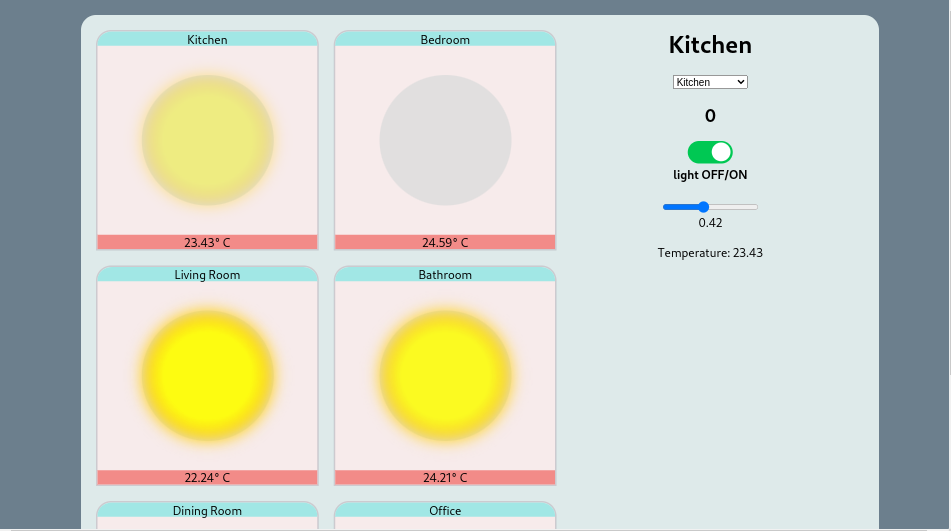

# Smart-Home-React
This is react application for smart home lamp control. Currently not using any API for dealing with hardware

Every state changing is saving to json file, which used in this app as database of rooms 

## Setting up:

```bash
# Clone this repository
$ git clone https://github.com/1Sayd/Smart-Home-React.git

# Go into the repository
$ cd Smart-Home-React

# Setup client
$ cd client
$ npm i
$ npm start

$ cd ../

# Setup server
$ cd server
$ npm i
# Enable backend service
$ node service.js
# Enable backend index
$ node index.js

# Remove current origin repository
$ git remote remove origin
```

## Screenshots

### Default state (server is off)


### Default state (server is on)


### Light Changing states


<p align="center">(Bathroom light is <b>OFF</b> with <b>brightness 23%</b>)</p>


<p align="center">(Bathroom light is <b>ON</b> with <b>brightness 62%</b>)</p>


<p align="center">(Bathroom light is <b>ON</b> with <b>brightness 23%</b>)</p>


<p align="center">(Kitchen light is <b>ON</b> with <b>brightness 74%</b> and Bathroom is <b>OFF</b> again)</p>

### Temperature Changing


### Layouts

#### Desktop:



<p align="center">(720p)</p>


<p align="center">(1080p)</p>

#### Mobile:


<p align="center">(Iphone XE)</p>

#### Tablet:


<p align="center">(Ipad Air)</p>